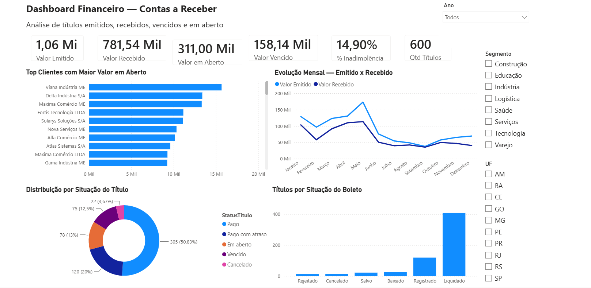
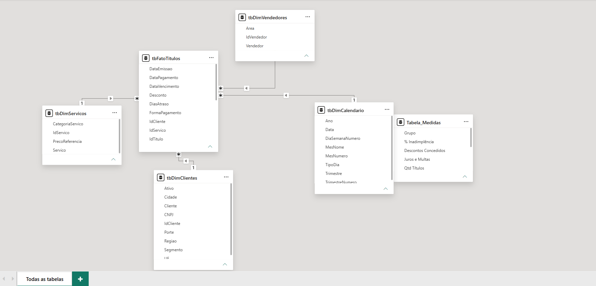
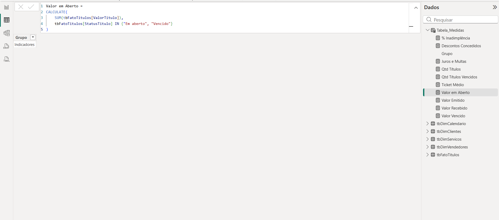
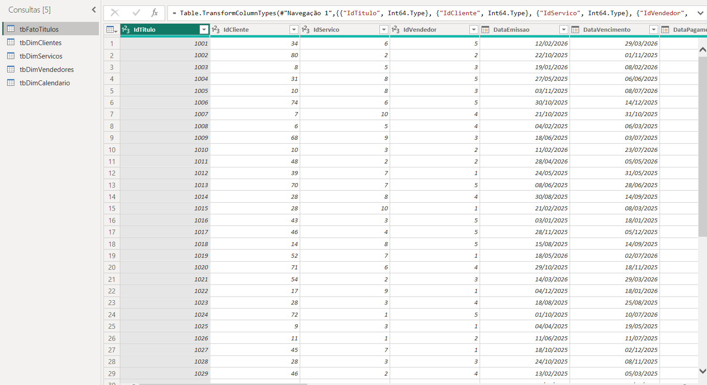

# Dashboard Financeiro — Contas a Receber

Projeto desenvolvido no Power BI com dados fictícios para análise de contas a receber, inadimplência, valores emitidos, recebidos, vencidos, em aberto, situação de boletos e principais clientes com saldo pendente.

## Objetivo

Simular uma demanda real da área financeira, transformando uma base de dados fictícia em indicadores visuais para apoiar a tomada de decisão sobre recebíveis, inadimplência e clientes com maior saldo em aberto.

## Ferramentas utilizadas

- Power BI
- Power Query
- DAX
- Excel
- Modelagem de dados
- Power BI Service

## Indicadores criados

- Valor emitido
- Valor recebido
- Valor em aberto
- Valor vencido
- Percentual de inadimplência
- Quantidade de títulos
- Evolução mensal entre valor emitido e valor recebido
- Top clientes com maior valor em aberto
- Distribuição por situação do título
- Títulos por situação do boleto

## Dashboard



## Modelo de dados



## Medidas DAX



## Power Query



## Estrutura do projeto

```text
dashboard-financeiro-powerbi/
│
├── dashboard_financeiro_contas_a_receber.pbix
├── base_powerbi_contas_a_receber_profissional.xlsx
├── README.md
│
└── imagens/
    ├── dashboard-final.png
    ├── modelo-dados.png
    ├── medidas-dax.png
    └── power-query.png
